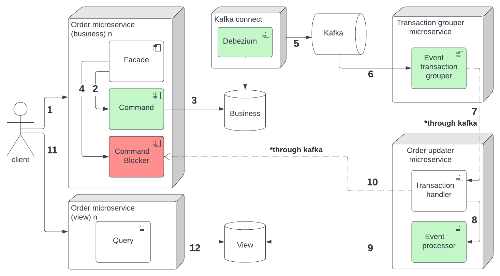

# Example library
The library is a simple example of a project that uses the command query responsibility segregation ant the materialized view design patterns.

Simplified component flow diagram: 

## Installation
0. Make gradle executable
```bash
chmod +x ./gradlew
```

1. Build services
```bash
./gradlew :order-service:bootJar :order-updater-service:bootJar :order-view-service:bootJar :transaction-grouper-service:bootJar 
```

2. Start dockerization of the project
```bash
docker compose up --build -d
```

3. Create debezium connector
```bash
curl -i -X POST -H "Content-Type:application/json" http://localhost:8083/connectors/ -d @config/connectors/register-postgres.json
```

4. Application is available on http://localhost:8080 (business microservice) and http://localhost:8180 (view microservice)

5. Swagger OpenAPI specification can be found at `./order-service/src/main/resources/openapi/order-service.yml` (business API) and `./order-view-service/src/main/resources/openapi/order-view-service.yml` (view API). The Insomnia export can be used as an example `./insomnia_export.json`